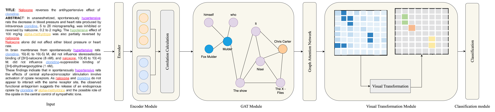

# ANAVIT: Enhancing Document-Level Relation Extraction with Anaphor Nodes and Visual Transformation

[](https://www.python.org/downloads/)
[](https://opensource.org/licenses/MIT)

A novel framework for document-level relation extraction that combines graph-based anaphora resolution with visual transformation techniques.

## Abstract

ANAVIT (Anaphor-Assisted Visual Transformation) enhances document-level relation extraction through two key innovations:
1. **Anaphor nodes integration** in document graphs to explicitly model pronoun-entity relationships via Graph Attention Networks
2. **Visual transformation** of relation matrices using convolutional neural networks and multi-head attention to capture global patterns

## Key Results

| Dataset | ANAVIT | ATLOP | Improvement |
|---------|--------|-------|-------------|
| CDR     | 79.1%  | 69.4% | +9.7 points |
| GDA     | 84.7%  | 83.9% | +0.8 points |

## Features

- **Heterogeneous Graph Construction**: Explicit modeling of anaphoric relationships through dedicated anaphor nodes
- **Graph Attention Networks**: Enhanced entity representation quality through coreference relationships
- **Visual Transformation**: Spatial processing of relation matrices for global pattern capture
- **Adaptive Thresholding**: Learnable thresholds that adapt to each entity pair
- **SciBERT Integration**: Domain-specific pre-trained model for biomedical text

## Architecture



The ANAVIT pipeline consists of:

1. **Encoder Module**: SciBERT-based contextualized word representations
2. **GAT-based Entity Enhancement**: 
   - Anaphor detection using spaCy POS tagger
   - Heterogeneous document graph with mention and anaphor nodes
   - Graph Attention Networks for node interactions
3. **Visual Transformation Module**:
   - 2D convolution with 5×5 kernels
   - Multi-head self-attention on spatial patterns
   - Three reasoning patterns for relation extraction
4. **Adaptive Thresholding**: Dynamic threshold learning per entity pair

## Installation

```bash
git clone https://github.com/vinhpad/anavit.git
cd anavit
pip install -r requirements.txt
```

## Usage

### Training
```bash
bash scripts/run_cdr.sh 
```


## Contact

- GitHub: https://github.com/vinhpad/anavit

## License

This project is licensed under the MIT License - see the LICENSE file for details.

## Acknowledgments

This work builds upon ATLOP and integrates advances in graph neural networks and visual processing for NLP. Special thanks to the biomedical NLP community for providing the CDR and GDA datasets.